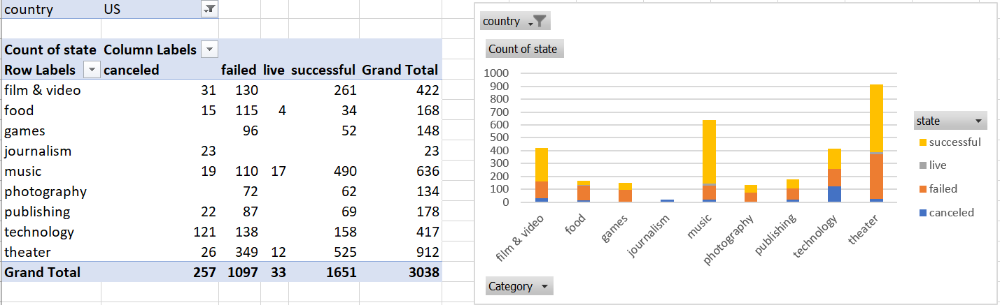
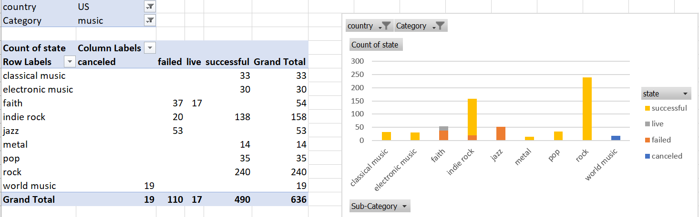
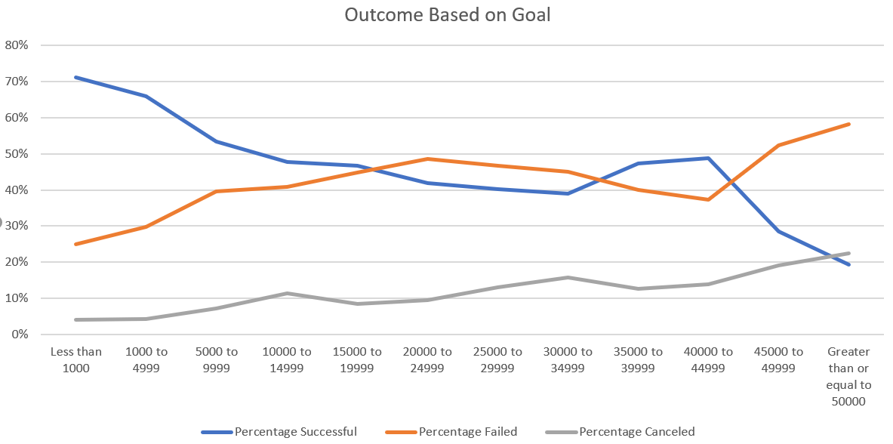

Challenge completed on: September 26, 2020

## Background

Over $2 billion has been raised using the massively successful crowdfunding service, Kickstarter, but not every project has found success. Of the more than 300,000 projects launched on Kickstarter, only a third have made it through the funding process with a positive outcome.

Getting funded on Kickstarter requires meeting or exceeding the project's initial goal, so many organizations spend months looking through past projects in an attempt to discover some trick for finding success. For this week's homework, you will organize and analyze a database of 4,000 past projects in order to uncover any hidden trends.

### Conclusion

*Noticeable trends included:*

* In the US and in the timeframe the data is in, theatre was a popular category for Kickstarter projects, but it was most likely to succeed in the music category (success rate of 77%). Journalism is also a hard category to follow through, as all 23 projects were canceled. 

* Within the US music category, Classical, Electronic, Metal, Pop, and Rock music were all successful with a 100% success rate. Faith and Jazz were not as successful (Jazz has a 0% success rate and Faith has only failed and live projects). 

* Projects with goals of $15,000 or less are more likely to meet their target. Projects with more than $40,000 are less likely to meet their target. 

*Analysis Limitations*

* Geographical influence. The data is limited to the 21 countries represented. Other countries may have a different environment and the same conclusions may not be applicable. Most of the data is collected in the US, thus, the data is swayed towards the US market and environment. 

* The consistency and accuracy of assigning a category and sub-category. The category and sub-category are inputted by a user and since each user’s perspective may differ, this may cause some inconsistency.

* Data includes various currencies and were not converted into a single currency. For comparison, it is important to evaluate each project under the same metric (currency value). 

### Future Work 

*  Grouping successful projects by their geographical location will help to understand the trends and interests coming from each country/geographical area. 

* Look into the relationship between `Project Success` and `Backers Count`. Although backers contribute different amounts, by analyzing the success rate (by count) versus the number of backers, we can evaluate if there are any relationships between these two variables. 

* Look into the relationship between `Project Success` and `Staff Pick`. This will help to understand if staff picks have an influence in the project’s success. 
