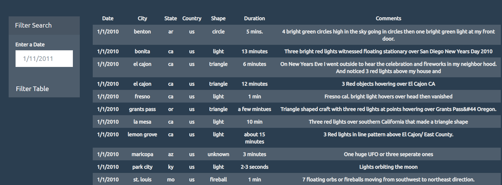

Challenge completed on: January 14, 2021

## Background

Data was collected on all eye-witness report of UFOs. The information was put into a dashboard using JavaScript and HTML. 

With such a large collection of data, a filter was created for the user to better navigate through each report. 

### Dashboard

### Filter Function 

With the filter, the user can search by inputting a date. The dashboard will clear the table and append the search results. 

