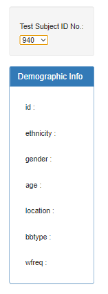
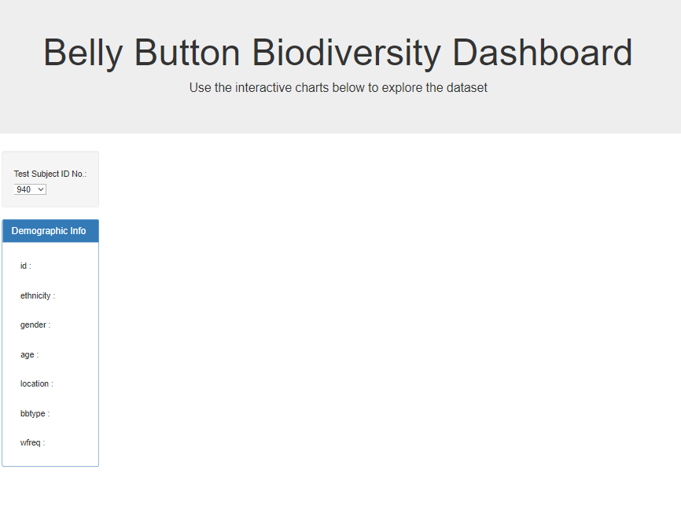
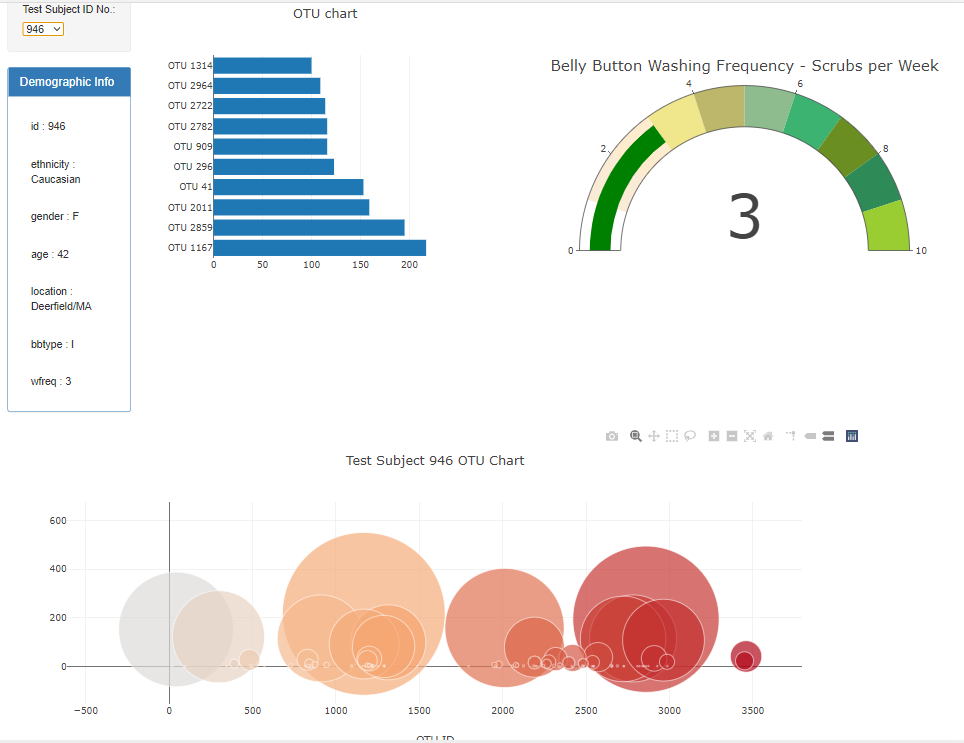

Challenge was completed on: January 12, 2020

## Background

An interactive dashboard to explore the [Belly Button Biodiversity dataset](http://robdunnlab.com/projects/belly-button-biodiversity/), which catalogs the microbes that colonize human navels was created using Javascript, HTML, and css style files. D3 and Plotly were used. 

The dataset revealed that a small handful of microbial species (also called operational taxonomic units, or OTUs, in the study) were present in more than 70% of people, while the rest were relatively rare.

Various visuals were created to make up the dashboard. 

## Dropdown Menu

A dropdown menu was generated using Javascript. For each unique test subject, it created an option in the menu. 

## Dashboard

This is the home page of the dashboard. The user must select a test subject in the menu. 

## Selected Test Subject

Once a subject is selected, the visuals will populate accordingly

