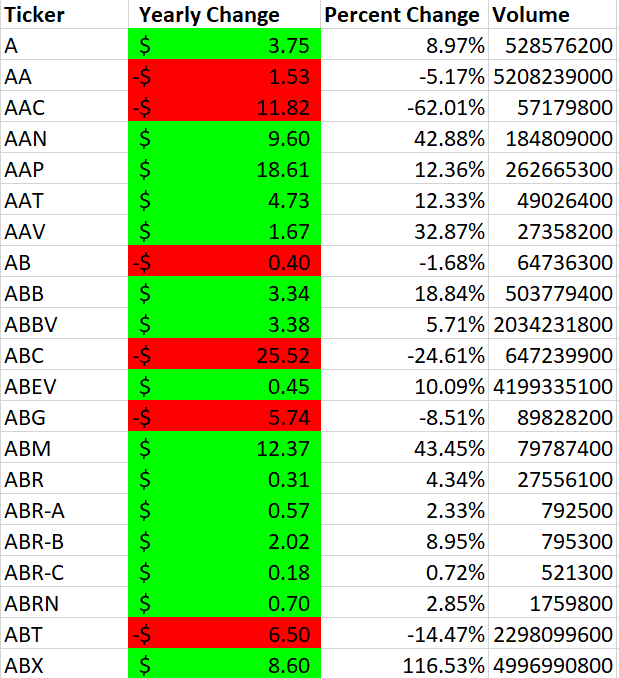

Challenge completed on: October 2, 2020

## Background

To develop a VBA script that will analyze New York Stock Exchange data. Data was provided on each ticker's daily stats, which includes: `Opening Price`, `High`, `Low`, `Closing Price`, and `Volume`. 

Example of the data: 

### Stock Market Analyis

The VBA Macro will output the following: 

Summary of each ticker's yearly change, percent change, and volume. Changes are also colour-coded for more ease in analysis. 

It will also output the NYSE's ticker with the greatest increase and decrease, as well as the ticker with the greatest volume. 

