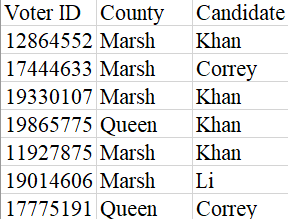
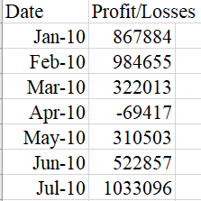

Challenge completed on: October 15, 2020

## Background

Two python scripts have been written to: 1. Calculate election data and count each candidate's votes (PyPoll) and 2. analyze financial records of a company to output a summary of profit/losses. 

## PyPoll

Raw data was provided as such: 



The script will output a text file of the results.

  ```text
  Election Results
  -------------------------
  Total Votes: 3521001
  -------------------------
  Khan: 63.000% (2218231)
  Correy: 20.000% (704200)
  Li: 14.000% (492940)
  O'Tooley: 3.000% (105630)
  -------------------------
  Winner: Khan
  -------------------------
  ```

## PyBank

Raw data was provided as such: 



The script will output a text file of the results.

  ```text
  Financial Analysis
  ----------------------------
  Total Months: 86
  Total: $38382578
  Average  Change: $-2315.12
  Greatest Increase in Profits: Feb-2012 ($1926159)
  Greatest Decrease in Profits: Sep-2013 ($-2196167)
  ```

