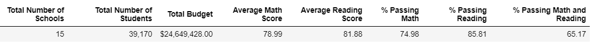
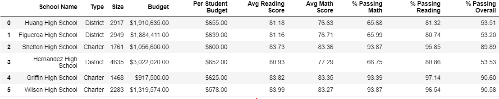
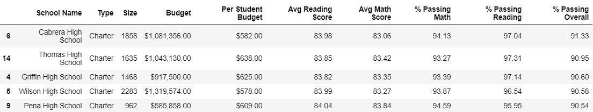
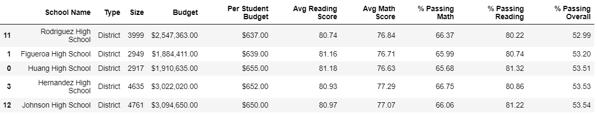
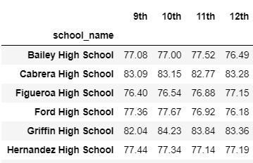
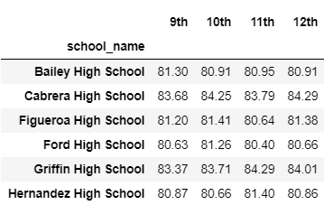
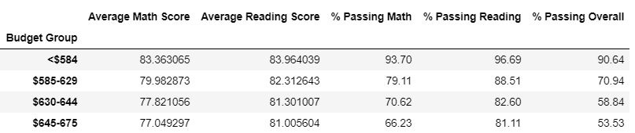
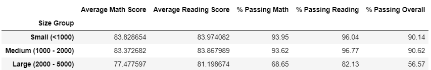
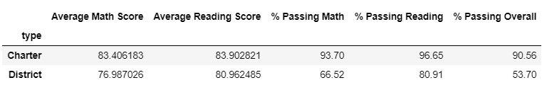

# Pandas Homework - Pandas, Pandas, Pandas

## Background

Using the Pandas library in Python, this script extracts raw data from csv files into a single Pandas dataframe. This allows for easier transformation and cleaning of the data thus, creating better summary tables of the data. 

## PyCitySchools

With a collection of school data, which includes their `Budget`, `Size`, and `Type` (District or Charter), as well as data on student's math and reading scores, the following analysis explores relationships between various factors. 

###Conclusions

* District schools have higher math and reading averages, as well as more students pass these subjects in District schools (in comparison to Charter schools). Math scores have the greatest diffference and math program need to be reveiwed in district type schools.

* Schools with less than 2,000 students generally do better than schools with more students. Schools should disperse their students to ensure resources reach every students (i.e. have other students attend schools with less than 1000 students, or build more schools in areas with more students). 

* School budget have an inverse relationships with passing students/average grades. This shows that more money does not mean better grades or more passing students. 

### District Summary

### School Summary

### Top Performing Schools (By % Overall Passing)

### Bottom Performing Schools (By % Overall Passing)

### Math Scores by Grade

### Reading Scores by Grade

### Scores by School Spending

### Scores by School Size

### Scores by School Type

