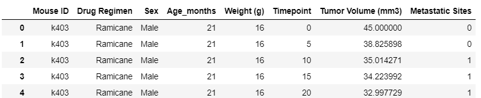
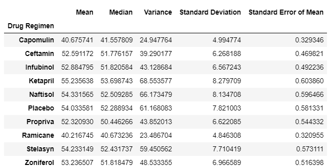
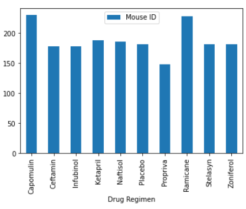
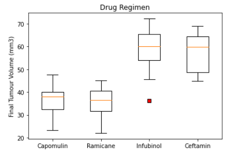
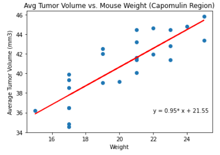

Challenge completed on: October 31, 2020

## Background

Using the Python Matplotlib library, plots were created to visualize laboratory test results. 

Data was created to mimick an animal study of 249 mice with a tumour growth. Different drug regimens were used over the course of 45 days. Tumour development was observed and recorded. 

This analysis uses Python to transform the data form csv into dataframes. This includes cleaning and removing any duplicates. With dataframes, summary tables and figures were generated to compare a drug of interest: Capomulin, against other treatments. The script also generates a top-level summary of the results. 

Raw data provided was extracted as such: 

### Top-Level Summary 

Using the groupby and aggregation functions, the data was summarized efficiently by drug type. 

### Comparison Analysis

Using a box plot, the performance of the drug of interest can be easily compared against other drug regimens. 

A linear regression between `Mouse Weight` and `Tumour Volume` was also performed using the linregress function. The following plot was generated. 

