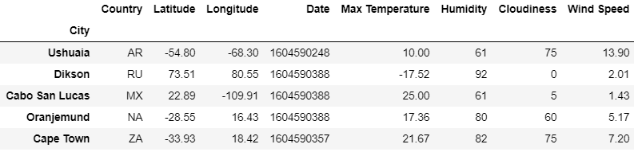
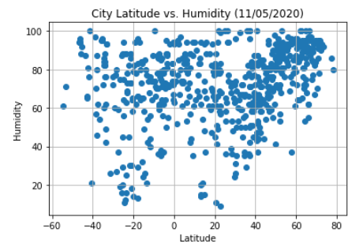
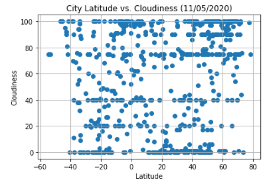
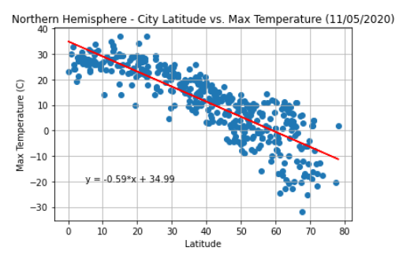
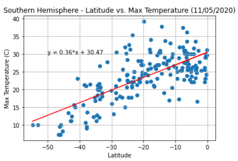

Challenge completed on: Novemeber 5, 2020

## Background

A Python script was written to visualize the weather of 500+ cities across the world of varying distance from the equator. This challenge includes the use of the Panda, Matplotlib, and CitiPy libraries, as well as the extraction of API data in JSON format. 

## Data Extraction

To accomplish this, latitude and longitude coordinates were extracted from the CitiPy library, weather was extracted from the [OpenWeatherMap API](https://openweathermap.org/api), and a list of cities was created on a csv file. 

The data was combined into a single dataframe. 

## Analysis on city latitude's influence on weather

It is as expected that as the city is closer to the equator, the weather is warmer. This is proven in the scatter plot below. 

No clear trend was observed in humidity of each city against its latitude. 

No clear trend was observed in cloudiness of each city against its latitude either. However, there seems to be bin gorups in intervals of 20 in the data.  

## Regression Analysis 

Linear regressions were done using the linregress function. Two regressions were done with cities in the Northern Hemisphere and those in Southern Hemisphere. 

