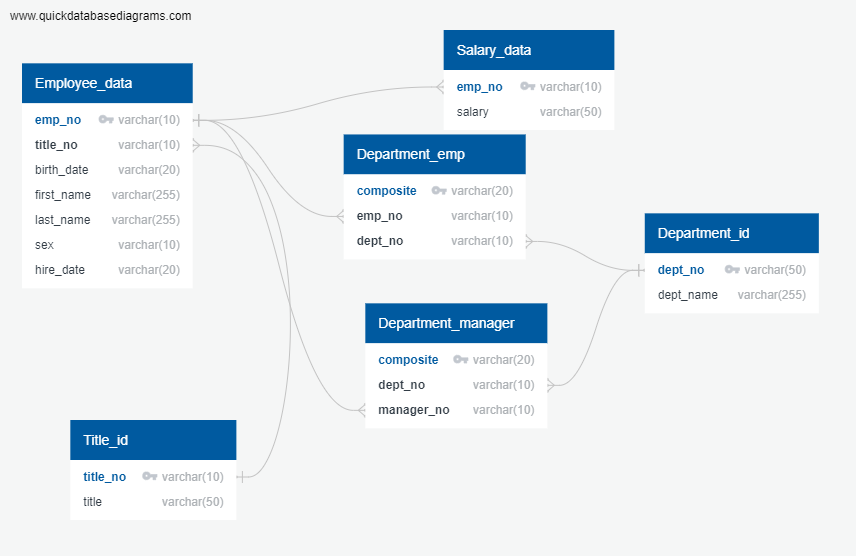

Challenge completed on: November 24, 2020

## Background

Six CSV files were created to mimick the remains of a database of employees. In this challenge, the CSVs were imported into a SQL database and analyzed. The challenge was divided into two sections: data engineering and data analysis. 

#### Data Modeling

To plan out how the database will be constructed, and ERD was created. 

#### Data Engineering

Tables were created for each table, specifying data types, primary keys, any foreign keys, and other constraints. The code was saved in the file: QuickDBD-exports.sql

#### Data Analysis

Queries were made using SQL to extract specific data from the database. These queries were saved in the file: Analysis.sql

