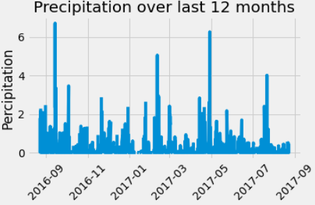
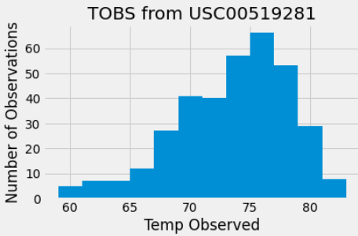

Challenge completed on: December 5, 2020

### Background

Using Python and SQLAlchemy, a climate analysis and data exploration of a climate database was done. All of the following analysis was completed using SQLAlchemy ORM queries, Pandas, and Matplotlib.

In addition, a Flask API was designed based on the various queries. 

*If you are running the code, please make sure database is open* 

## SQLAlchemy Connection

A sqlite database was created: [hawaii.sqlite](Resources/hawaii.sqlite) with files to complete the analysis and data exploration.

* Using SQLAlchemy `create_engine`, the sqlite database was connected and using `automap_base()`, tables were reflected as classes for analysis. 

### Precipitation Analysis

With precipitation data from the last 12 months, a plot was created using Matplotlib. 

### Station Analysis

The weather station with the highest number of observation was determined and a query was done to retreive the last 12 months of temperature observations (TOBS). A histogram with bin sizes of 12 was created. 

- - -

## Climate App

A Flask API was created with the following routes in additon to the home page: 

* `/api/v1.0/precipitation` to return the `date` as the key and `prcp` as the value in JSON format

* `/api/v1.0/stations` to return a full list of all stations (unique)

* `/api/v1.0/tobs` to return the temperature of observations for the most active station

* `/api/v1.0/<start>` and `/api/v1.0/<start>/<end>` to return the average temperature, max temperature, and min temperature within the given start and end dates 
  * When given the start only, calculate `TMIN`, `TAVG`, and `TMAX` for all dates greater than and equal to the start date.

  * When given the start and the end date, calculate the `TMIN`, `TAVG`, and `TMAX` for dates between the start and end date inclusive.

