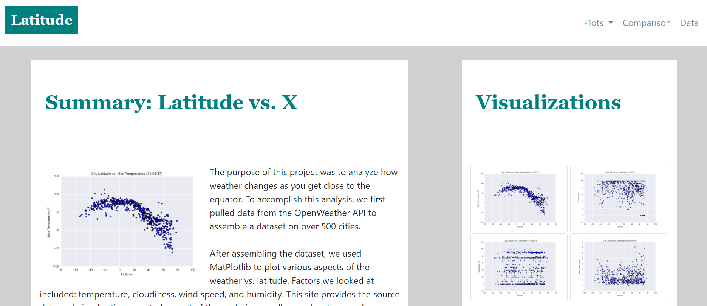
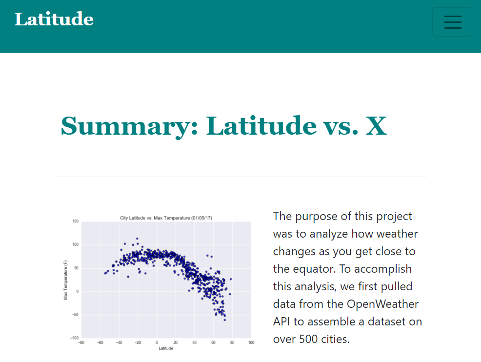
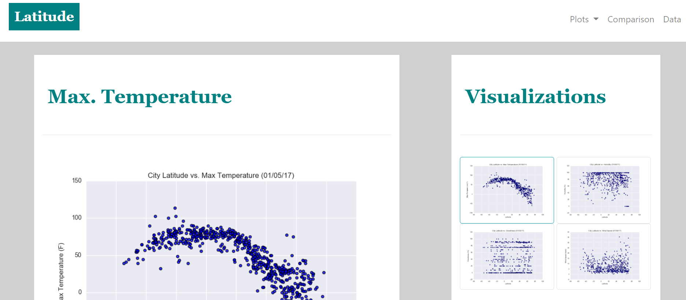
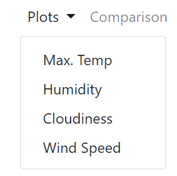
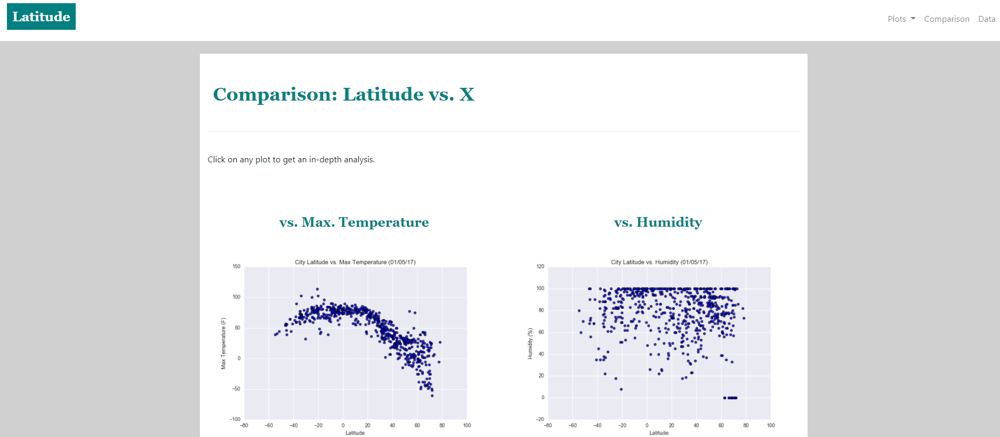

Challenge completed on: December 8, 2020

## Background

Data is more powerful when visualized and shared! Using HTML and CSS, a dashboard was created to showcase the analysis done in [6. API Challenge](https://github.com/angmay/databootcamp/tree/master/6.%20API%20Challenge). The website was created to be responsive with size and includes the following pages: 

*All pages are responsive!*

### Home Page 

On a full screen: 

On a smaller screen: 

### Plot Page

Each plot has its own page with includes a description of the analysis. 

The user can navigate to these pages using the drop down menu on the top right corner or by click on the plots on the right side of the home page. 

### Comparison

This page displays all plots. If user clicks on plot, they will be taken to the specific plot's page. 

### Data 

This page displays all the raw data. 

